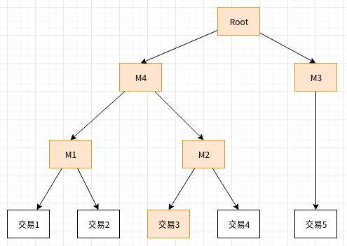
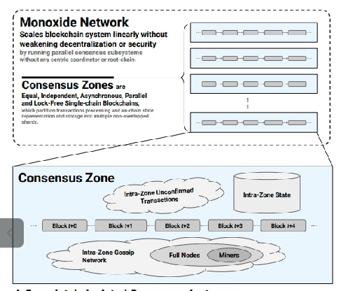
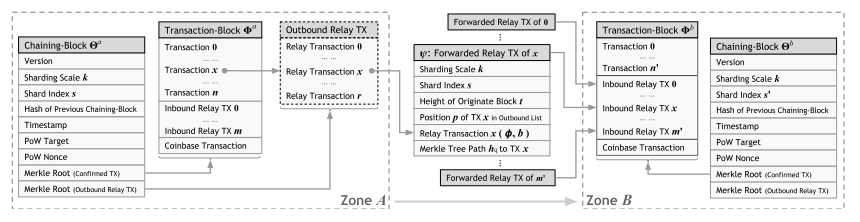
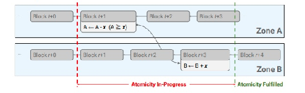
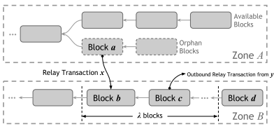

# Monoxide: Scale Out Blockchains with Asynchronous Consensus Zones

## 名词解释

### Merkle验证路径

为了证明交易3存在于一个交易集中，可以提供一个Merkle验证路径，即图中的\(Root, M4, M3, M1, M2, 3\)，通过如果通过路径恢复的根Hash与Root值一致，则证明成立。

## 系统设计

### 帐户

Monoxide的帐户采用Account/Balance模型，帐户包含一些状态，公钥哈希值用作帐户地址\(Address\)，可以唯一标识帐户。所有帐户按照地址被分割到$$2^k$$ 个组。

### 共识组

节点拥有一个持久化的标识符\(可在第一次启动时随机初始化\)，所有的节点根据标识符也被分割 为 $$2^k$$个分区。每个分区用 $$(s,k)$$ 唯一表示，其中 $$s$$ 是分区号， $$k$$ 是分区系数， $$2^k$$ 是分区总数。

属于同一个分区的全节点组成一个共识组\(Consensus Zone\)。

###  网络

系统网络被划分为一些逻辑分区，称为Swarm。节点加入Swarm后可以向本Swarm广播交易或者接受本Swarm内其它节点广播的块或交易。

每个共识组都有一个自己的Swarm，同时系统中存在一个Global Swarm，所有的节点都会加入该Swarm，用来完成跨共识组通讯。

网络通信采用DHT算法，用来实现Swarm寻址和节点发现。

## 区块

Monoxide中存在两种类型的块: chaining-block和transaction-block. 

* chaining-block包含链信息和POW校验元信息，可以执行快速校验，transaction-block包含块中已确认的交易。
* chaining-block的占用空间固定，大概100字节; transaction-block的占用空间随着交易数和交易大小会发生很大变化
* transaction-block一般存储在全节点中。

## 交易

Monoxide将帐户也划分到多个组，交易涉及的帐户有可能跨越多个组。同组内的交易执行流程与现有的区块链系统\(Bitcoin, Ethereum\)类似，当帐户跨越多个组时，不但要保证交易的原子执行，还要保证交易执行的效率。

### 交易流程

以帐户Alice向帐户Bob转帐为例，其中Alice属于组A, Bob属于组B:

1. 组A内的矿工收到Alice的交易请求p
2. 矿工对交易进行校验，保证交易有效且合法。交易校验通过后:
   * 如果A，B是相同的组或者交易是Inbound中继交易，则将交易放在块的交易列表中
   * 如果A，B是不同的组，则对交易进行拆分为两部分:
     * 对Alice的扣款交易，放到块的交易列表
     * 对Bob的充值交易，放到Outbound中继交易列表
3. 矿工对新块执行POW算法\(假设使用POW共识算法\)，成功后将发现的新块chaining-block广播到global swarm, transaction-block广播到本组的swarm
4. 矿工收到新的transaction-block块，如果块是本组的并且校验通过，则执行其中的交易。对于Outbound中继交易，将中继交易发送到目标组。

### 中继交易

Alice向Bob转帐的例子中，当Alice和Bob不在同一个组时，会产生中继交易:

$$
\psi=(\phi,Bob,\gamma)
$$

其中 $$\phi$$ 是转帐金额，Bob是目标帐户， $$\gamma$$ 是中继交易证明。

中继交易证明用来证明一个中断交易的合法性，证明数据包含:

$$
\gamma=(s,k,t,p,\{h_q\})
$$

其中$$s$$ 是组号，$$k$$ 是分区系数， $$t$$ 是块高度， $$p$$ 是 $$t$$ 指定的块中Outbound中继事务索引号， $$\{h_q\}$$ 是Merkle树验证路径。

### 最终原子性

跨组交易被拆分成多个部分，交易的最终执行依赖于中继交易的执行，通过激励机制最终能保障中继交易的执行，所以交易最终是原子的。

### 分叉

POW算法存在分叉的可能，而跨组交易又是最终一致的，当出现分叉时，中继交易及其后续交易需要进行回滚操作，根据分叉的时机，考虑以下情况:

* 矿工在分叉后收到分叉前中继交易

         这种情况中继交易在校验时会失败，所以无法被执行

* 矿工在分叉前收到中继交易

         这种情况下块b中来自块a的中继交易将被置为无效，同时自创世块开始重新执行所有交易\(不包括失效的中继交易\)。最块的情况是块C和它后面所有的块都置为无效。

为了避免这种情况的发生，矿工在收到Inbound中继交易后不立即加入到新块，而是延迟若干个块后再添加到新块，从而最大可能性地使这种情况不会发生。

