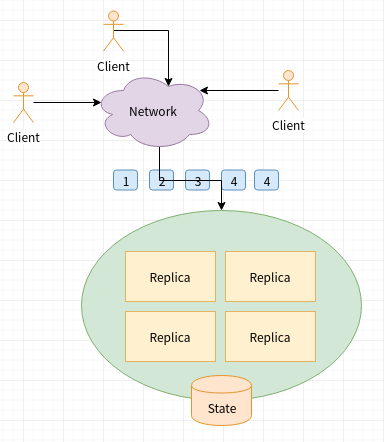
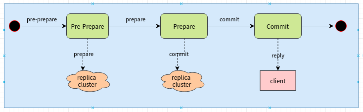
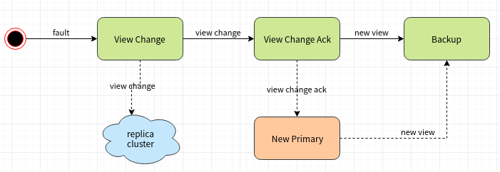
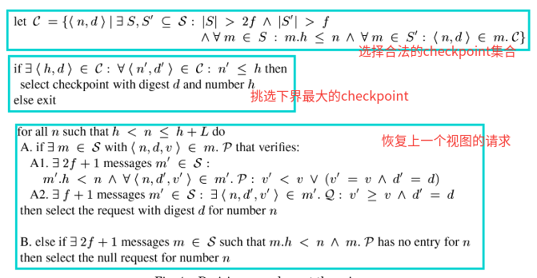

# Practical Byzantine Fault Toleranceand Proactive Recovery

[论文原文](https://drive.google.com/open?id=1t0-TWaR66MPQx-2v8N-Syzgm4VSvTRlp)

## 系统模型

### 拜占庭错误

replica可以是任意行为：下线、崩溃、拒绝服务、作恶、篡改数据等

### 网络模型

replica消息在网络上传输时可以出现丢失、延时、重复、乱序。

### 系统假设

* 出现错误的replica数量不超过 $$f$$ :

$$
f = \lfloor \frac{(n-1)}{3}\rfloor
$$

* 敌手的算力有限，无法攻破算法用到的密码学技术
* 弱同步: 消息延迟时间有上界，即消息从发出到被接收，只要没有丢失，就一定能被接收，并且延迟时间有上界。

## 算法性质

### 安全性

所有的replica按照同样的顺序执行相同操作

### 活性

最多允许 $$f = \lfloor \frac{(n-1)}{3}\rfloor$$ 个replica出现错误

## 系统参数

### Replica集合

replica集合用 $$R$$ 表示，replica集群大小记为 $$|R|$$ 

每个replica存在一个唯一标识 $$p$$ , 其中:$$p \in [0,1,2,3,...,|R|-1]$$ 

系统允许replica错误的最大数量 $$f$$ , 其中: $$|R|=3f+1$$ 

### 视图

视图用整数 $$v$$ 表示. 每个视图存在一个主replica，主replica的标识: $$p = v \  mod \  |R|$$ 

### Quorum

至少 $$2f +1$$ 个replica构成的子集称为quorum, 记为 $$Q$$ , 即: $$ |Q| \ge 2f +1,Q \subset R$$

### Quorum Certificates

至少 $$2f+1$$ 个不同replica的消息构成一个quorum certificates, 记为 $$QC$$，即 $$|QC| \ge 2f+1$$

至少 $$f+1$$ 个不同replica的消息构成一个weak certificates, 记为 $$WC$$，即 $$|WC| \ge f+1$$

## 主要技术

状态机复制\(State Machine Replication\)技术的难点是保证非错误的replica节点以相同的顺序执行相同的操作。算法采用两个技术解决这个问题:

* 主备机制\(Primary-backup\)
* Quorum

算法使用Primary-backup技术决定_请求操作的执行顺序_\(ordering for execution of operations\)，Quorum技术解决节点异常\(崩溃等非拜占庭问题\)问题。

### Primary-backup

* replica被划分成_primary_和_backup_两种角色。
* primary稳定运行的时间窗口称为_视图\(View\)_，当primary失败会发生视图切换
* 每个视图只有一个primary，其它replica都是backup
* primary负责决定客户端请求的顺序，为每个客户端请求分配一个_序列号\(sequence number\)_
* 在一个视图内请求序列号连续递增。

### Quorum

算法使用**Byzantine dissemination quorum system**，这些quorum满足2个性质:

* 任意两个quorum: $$Q_1$$和 $$Q_2$$ ，则至少有一个正确的replica节点 $$p$$ 满足:

$$
p \in Q_1 \cap Q_2
$$

* 总存在至少一个quorum，这个quorum不存在错误的replica节点。

这两个性质保证可以将这个quorum system看成一个可靠存储存放一些协议信息。

## 客户端

### 会话

客户端会和replica建立连接，并协商一个会话密钥，用于验证消息MAC

### 请求

客户端 $$c$$向replica集群组播\(multicast\)一个操作请求: $$<Request, o, t, c>$$ ，其中:

* $$o$$ 代表操作
* $$t$$ 代表操作发起的时间戳

### 响应

replica节点在操作处理完成后会返回客户端一个响应: $$<Reply, v, t, c,i,r>$$ ，其中:

* $$v$$ 是当前的视图号
* $$i$$ 是响应节点的标识
* $$r$$ 是操作结果

客户端会收集来自 $$f+1$$ 个不同replica节点的响应，并验证:

* 响应消息的MAC合法有效
* 所有响应的 $$(c,v, t, r)$$ 相等

验证通过后，则请求成功。$$f+1$$ 个响应构成一个Weak Certificates，又称为_Reply Certificate_。

### 请求重发

超过一定的时间后，如果客户端没有接收到Reply Certificate\(没有收集到足够的响应\)，就会重发请求。

replica节点会保存它向客户端响应的最后一条Reply，如果replica节点已经响应过该请求，则将保存的reply响应给客户端。

### 资源消耗

为了支持客户端，replica节点会有一些额外消耗:

* 客户端ID与会话密钥的映射
* 客户端最后一条请求的响应

## 正常流程

replica节点的Pre-prepare, Prepare, Commit状态分别对应3PC的Pre-prepare, Prepare, Commit阶段。

### replica状态数据

* replica节点当前状态: 
  * Pre-prepare
  * Prepare
  * Commit
* 消息日志\(message log\)。记录节点发送、接收到的消息，消息日志可以不用持久化:
  * 客户端发送的Request消息
  * 节点发送或接收的Pre-prepare, Prepare,  Commit消息
  * 节点发送给客户端的Reply消息
* replica节点当前处于的视图

### Pre-Prepare消息

Primary收到客户端消息$$m=<Request, o, t, c>$$ :

1. 保存客户端消息到消息日志，并为消息分配一个序列号 $$n$$ 
2. 向其它replica节点发送Pre-prepare消息 $$<Pre-prepare, v, n, D(m)>$$ ，其中 $$D(m)$$ 是消息摘要，并保存Pre-prepare消息到消息日志
3. 节点进入Pre-prepare状态

Backup收到Primary的Pre-prepare消息$$<Pre-prepare, v, n, D(m)>$$ :

1. 检查消息是否可以接受:
   * 消息视图与节点的视图相同
   * 消息的序列号 $$n \in (h, H]$$ , $$h$$和 $$H$$ 是一个序列号边界。
   * 校验消息的MAC值
   * 没有接收过和这个消息 $$(v,n)$$ 相同，但消息摘要不同的其它消息
2. 如果消息检查失败，则忽略消息; 如果成功，则将消息保存到消息日志。
3. 如果replica节点包含请求$$m$$ ，则节点进入Pre-prepare状态，
4. 向其它节点发送Prepare消息 $$<Prepare, v, n,D(m), i>$$ ，并将这个消息保存到消息日志。

Pre-prepare消息为客户端请求分配一个全序的序列号，并尝试将序列号同步到整个replica集群。

### Prepare消息

replica节点收到其它节点的Prepare消息$$<Prepare, v, n,D(m), i>$$:

1. 检查消息是否可以接受
   * 消息视图与节点的视图相同
   * 消息的序列号 $$n \in (h, H]$$ , $$h$$和 $$H$$ 是一个序列号边界。
   * 校验消息的MAC值
   * 没有接收过和这个消息 $$(v,n,i)$$ 相同，但消息摘要不同的其它消息
2. 如果消息检查失败，则忽略消息; 如果成功，则将消息保存到消息日志。
3. 如果replica节点包含对应的Pre-prepare消息，以及收集到至少$$2f$$ 个来自不同replica的Prepare消息，即这至少 $$2f+1$$ 个消息拥有相同的 $$(v,n,D(m))$$，则节点进入Prepare状态。
4. 向其它节点发送Commit消息 $$<Commit, v,n,D(m), i>$$ ，并将Commit消息保存在消息日志

replica本身的Pre-prepare消息，以及收集到的至少$$2f$$ 个来自其它不同replica的Prepare消息，这说明集群内至少 $$2f+1$$ 个节点同意Primary给客户端请求分配的序列号。这 $$2f+1$$ 组消息成了一个_Quorum Certificate，也被称为Prepared Certificate_

Prepare消息保证Primary给客户端请求分配的序列号被一个Quorum接受: 即使出现至多 $$f$$ 个backup节点出现错误，算法也可以安全运行。

### Commit消息

replica节点收到其它节点的Commit消息 $$<Commit, v,n,D(m), i>$$ :

1. 检查消息是否可以接受
   * 消息视图与节点的视图相同
   * 消息的序列号 $$n \in (h, H]$$ , $$h$$和 $$H$$ 是一个序列号边界。
   * 校验消息的MAC值
   * 没有接收过和这个消息 $$(v,n,i)$$ 相同，但消息摘要不同的其它消息
2. 如果消息检查失败，则忽略消息; 如果成功，则将消息保存到消息日志
3. 如果节点包含请求消息 $$m$$ ，并且消息日志中存在至少 $$2f+1$$ 个来自不同replica\(包括节点本身\)的Commit消息，则提交消息 $$m$$ 到执行队列。
4. 待所有序列号小于 $$m$$ 的消息都执行完成后，执行消息 $$m$$ 的操作
5. 向客户端发送响应Reply消息

replica节点收集到的至少 $$2f+1$$ 个来自不同replica\(包括节点本身\)的Commit消息组成一个_Quorum Certificat，也被称为Committed Certificate_

## 垃圾回收

### 安全性

算法在执行过程中会存储很多消息，这些消息需要被适当的清理，否则会占用过多的存储空间。

但是在清理消息之前需要保证安全性: 即证明请求操作被执行，并且执行后的状态正确。

### 回收时机

当请求序列号能整除固定值 $$K$$ 时，节点会进行垃圾回收协议。 $$K$$ 被称为_checkpoint period。_

### 执行状态

节点在执行客户端请求操作后会产生状态集，这些状态集被称为_checkpoint_。节点同一时刻可能维护多份checkpoint。

具有_Stable Certificate_的checkpoint称为_stable checkpoint。_节点会维护最后一份stable checkpoint。

### 流程

replica节点 $$i$$ 发起垃圾回收:

1. 向其它节点发送Checkpoint消息: $$<Checkpoint, n, d , i>$$ ，其中:
   * $$n$$ : 所有序列号小于或等于 $$n$$ 的消息都会被清理
   * $$d$$ : 所有序列号小于或等于 $$n$$ 的客户端请求的操作执行完后replica节点状态集的摘要
2. 接收来自其它结节的Checkpoint消息，如果收到的Checkpoint消息 $$(n,d)$$ 相同，则将消息保存
3. 如果消息日志中收到至少 $$2f+1$$ 个来自不同节点\(包括自己\)的Checkpoint消息，则可以安全地清理消息日志中所有序列号小于或等于 $$n$$ 的消息，以及早期的checkpoints.

至少 $$2f+1$$ 个来自不同节点\(包括自己\)的Checkpoint消息组成一个Quorum Certificate, 又称为_Stable Certificate_

### 序列号边界

replica节点会维护一个消息序列号边界 $$(h,H]$$ :

* $$h$$ : 等于最后一次stable checkpoint的序列号
* $$H$$: $$H = h + L$$ ，其中 $$L$$ 消息日志的容量， $$L = n*K$$ ， $$n$$ 是一个常量\(如2\)。

## 视图变更

当Primary出现错误时，为了保护算法能继续工作，需要将当前视图切换到新视图 $$v \to {v+1}$$ 

### 数据结构

数据结构 $$C$$ :

$$
C=\{(k,v)\}
$$

记录当前结点的所有checkpoint, 其中 $$k$$ 是checkpoint最大序列号, $$v$$ 是checkpoint的摘要

数据结构 $$P$$ :

$$
P=\{p|p=(n,d,v)\}
$$

记录当前replica节点收集到的带有prepared certificate的请求，其中:

* $$n$$ 是请求的序列号，且 $$n \in (h, H]$$ 
* $$d$$ 是请求的摘要
* $$v$$ 是请求发生时的视图

数据结构 $$Q$$ :

$$
Q=\{q|q=(n,d,v)\}
$$

记录当前replica节点已经发出的Pre-prepare消息的请求，或者收到的发出Prepare消息的请求，这些请求还没有prepared certificate.

数据结构 $$S$$ 是当前replica节点记录的所有带有view-change certificate的View-Change消息。

数据结构 $$V$$ :

$$
V=\{v|(i, D(vc)\}
$$

记录新视图的Primary的数据结构 $$S$$ 的摘要, 其中 $$i$$ 是发送View-Change消息的节点， $$D(vc)$$ 是对应View-Change消息的摘要

数据结构 $$X$$  记录了新视图Primary选择的checkpoint和请求

### View-Change消息

当replica节点 $$i$$ 认为Primary出现错误时

1. 会向集群发送View-Change消息 

$$
<View-Change, v+1, h, C,P,Q,i)
$$

其中:

* $$v+1$$ 是新的视图编号
* $$h$$ 是序列号边界下限

 2. 清空本地的Pre-Prepare、Prepare、Commit消息

### View-Change-Ack消息

replica节点收到View-Change消息:

1. 检查消息是否可以接受:
   * 检查消息的MAC
   * $$\forall x=(n_x,d_x,v_x)\in P \cup Q, v_x \le v $$ ， $$v$$ 代表变更前的视图编号
2. 如果不接受，则忽略消息；接受则向新视图的Primary发送View-Change-Ack消息:

$$
<View-Change-Ack, v+1, i, j, d>
$$

其中: $$i$$ 是发送View-Change-Ack消息的节点标识， $$j$$ 是发送View-Change消息的节点标识

### New-View消息

新视图的Primary会收到View-Change消息和View-Change-Ack消息:

1. 检查View-Change消息\(同上\)，接受将消息保存到消息日志
2. 检查View-Change-Ack消息，并检查消息MAC，接受后将消息保存到消息日志
3. 当Primary收集到 $$2f$$ 个来自其它节点\(包括自己\)的View-Change-Ack消息，这些消息都是对replica节点 $$j$$ 的View-Change消息的确认。则将节点 $$j$$ 的View-Change消息放入数据结构 $$S$$ 
4. 基于 $$S$$ 选择新视图的checkpoint:

  5. 执行选择checkpoint完成，向集群发送New-View消息: $$<New-View, v+1, V, X>$$ 

  6. 新Primary从其它replica节点获取缺失的checkpoint和请求，并发起checkpoint请求，得到一个stable checkpoint。

  7. 将挑选的请求的视图编号修改为 $$v+1$$ 

backup节点接收到New-View消息:

1. 等待收集完所有 $$V$$ 中对应的View-Change消息
2. 校验New-View消息合法，如果不合法，则将新视图切换到 $$v+2$$ 
3. 如果合法，则将状态置为与New-View消息同步\(同Primary\)，并为挑选的请求发送Prepare消息

