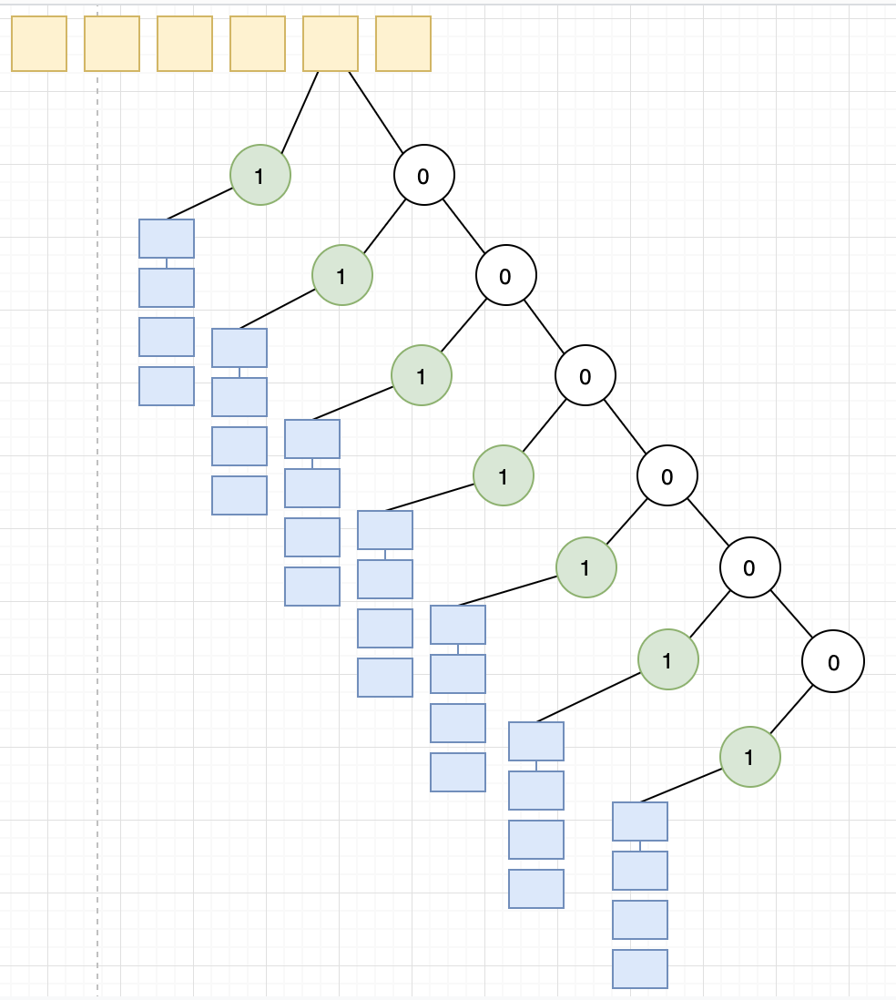

# Kademlia: A Peer-to-peer information system based on the XOR Metric

[论文原文](https://pdos.csail.mit.edu/~petar/papers/maymounkov-kademlia-lncs.pdf)

## ID

Kademlia网络中，每个节点有一个160位的唯一ID标识

## XOR距离

Kademlia网络中两个节点 $$x,y$$\($$x,y$$分别是两个节点的ID\)的距离 $$d(x,y)$$ :

$$
d(x,y)=x \oplus y
$$

XOR距离满足以下三个性质:

* $$d(x,x)=0$$ 
* $$d(x,y)=d(y,x)$$ 
* $$d(x,y)+d(y,z) \ge d(x,z)$$ 

## 路由表

### 节点状态

Kademlia网络中的节点 $$p$$ 会维护一张哈希表:

* 哈希表有160个入口项
* 每个入口项维护一个包含 $$k$$ 个 元素的链表: 入口 $$i$$ 保存和当前节点的距离 $$2^i \le d < 2^{i+1}$$的 $$k$$ 个有效节点信息
* 节点信息: &lt;IP, UDP Port, Node ID&gt;

### 最长前辍二叉树

路由表根据节点状态生成，采用一棵二叉树进行组织:

* 二叉树的叶节点是和当前节点的距离 $$2^i \le d < 2^{i+1}$$的 $$k$$ 个有效节点信息，其中 $$i$$是匹配深度 
* 基于节点ID进行最长前辍原则匹配离目标节点最近的节点。

### 构造

1. 初始是一棵空树
2. 一个新节点 B 连上当前节点 A 时，A 先计算距离，并根据距离搜索目标k-bucket。
   * 如果k-bucket未满，则直接插入
   * 如果k-bucket已满，检测 bucket 列头元素是否能够 ping 通，如果 ping 通，则抛弃新节点，无法 ping 通，则用新节点替换失效节点

## RPC

Kademlia协议包括四个RPC:

* Ping
* Store
* FindNode
* FindValue

### Ping

参数: 节点ID

作用: 探测目标节点是否在线

### FindNode

参数: 节点ID

响应: 接收到请求的节点响应自己知道离目标节点最近的 $$k$$ 个节点的信息

### Store

参数:

* 节点ID
* Key
* Value

作用: 在离key最近的k个节点上存储value

### FindValue

参数:

* key

作用: 向离key最近的k个节点上查询value

## 节点查询\(lookup\)

Kademlia协议最重要的流程是根据节点ID查询节点信息，协议采用一个递归流程:

1. 从本地路由表中挑选离目标节点最近的 $$\alpha$$个节点 
2. 并行的向这些节点发送FindNode请求, 等待节点的响应，并更新路由表
3. 如果已找到，则查询成功。如果未找到，则重新从路由表中挑选 $$\alpha$$个之前未查询的离目标节点最近的节点 ，然后执行步骤2

## 数据存储

Kademlia网络中可以通过Store接口存储&lt;Key, Value&gt;值，将Value存储是离Key最近的k个节点上。通过FindValue可以从网络中获取对应Key的值。

