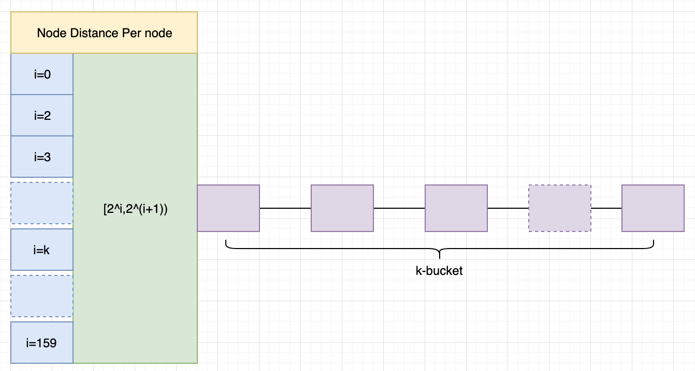
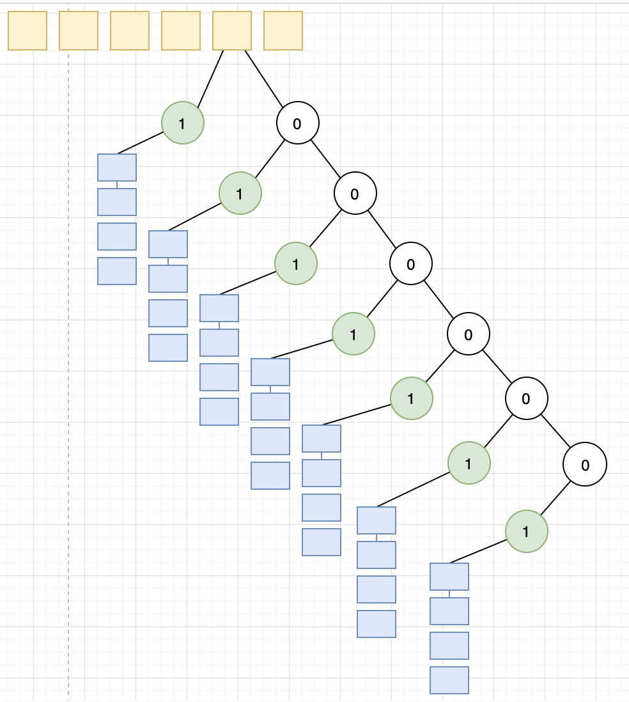

# Kademlia: A Peer-to-peer information system based on the XOR Metric

[论文原文](https://pdos.csail.mit.edu/~petar/papers/maymounkov-kademlia-lncs.pdf)

## ID

Kademlia网络中，每个节点有一个160位的唯一ID标识

## XOR距离

Kademlia网络中两个节点 $$x,y$$\($$x,y$$分别是两个节点的ID\)的距离 $$d(x,y)$$ :

$$
d(x,y)=x \oplus y
$$

XOR距离满足以下三个性质:

* $$d(x,x)=0$$ 
* $$d(x,y)=d(y,x)$$ 
* $$d(x,y)+d(y,z) \ge d(x,z)$$ 

## 路由表

### 节点状态

Kademlia网络中的节点 $$p$$ 会维护一张哈希表:

* 哈希表有160个入口项
* 每个入口项维护一个包含 $$k$$ 个 元素的链表: 入口 $$i$$ 保存和当前节点的距离 $$2^i \le d < 2^{i+1}$$的 $$k$$ 个有效节点信息
* 节点信息: &lt;IP, UDP Port, Node ID&gt;

### 路由表

